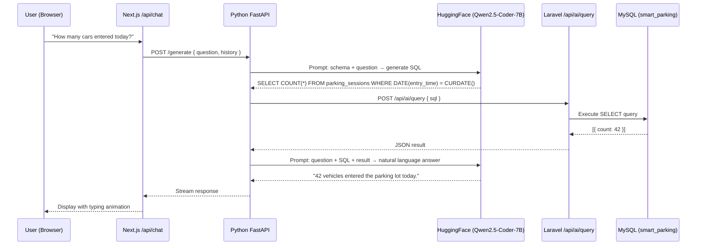

# Text-to-SQL AI Agent — Implementation Plan

## Architecture Overview

```
FYP DEVELOPMENT/
├── frontend/       ← Next.js (useChat → /api/chat)
├── backend/        ← Laravel (SQL execution endpoint)
└── ai-service/     ← Python FastAPI (LLM orchestration) ← NEW
```



## Decisions Made

| Decision | Answer |
|---|---|
| Python service location | `FYP DEVELOPMENT/ai-service/` |
| Python framework | FastAPI |
| LLM model | `Qwen/Qwen2.5-Coder-7B-Instruct` (text/code model, NOT Qwen3-VL-2B which is vision-only) |
| SQL safety | SELECT only — no INSERT, UPDATE, DELETE |
| Show generated SQL | Yes (for accuracy debugging, removable later) |
| HuggingFace tier | Free (~1000 requests/day = ~1000 user questions/day) |
| HuggingFace token | User will provide |

> [!IMPORTANT]
> **Why not Qwen3-VL-2B?** Qwen3-VL-2B-Instruct is a **Vision-Language** model for image tasks (like your license plate OCR). For **Text-to-SQL**, we need `Qwen2.5-Coder-7B-Instruct` which is specifically trained for code/SQL generation from text. Using a vision model for SQL would produce very poor results.

## Proposed Changes

### Component 1: Python AI Service (NEW)

#### [NEW] `ai-service/main.py`

FastAPI app with a `/generate` endpoint that:
1. Receives `{ question, history }` from the Next.js API route
2. Constructs a prompt: database schema (RAG context) + user question
3. Calls HuggingFace Inference API → Qwen2.5-Coder-7B generates SQL
4. Sends the SQL to Laravel for execution
5. Calls HuggingFace again to generate a natural language answer from the results
6. Streams the response: "I ran the query `SELECT ...` and found: 42 vehicles entered today."

#### [NEW] `ai-service/schema_context.py`

Database schema as a prompt string for RAG injection:

```python
SCHEMA_CONTEXT = """
## Database: smart_parking (MySQL)

### Table: parking_sessions
| Column        | Type                              | Description                        |
|---------------|-----------------------------------|------------------------------------|
| id            | BIGINT PK AUTO_INCREMENT          | Unique session ID                  |
| license_plate | VARCHAR(255)                      | Vehicle license plate number       |
| color         | VARCHAR(255)                      | Vehicle color                      |
| model         | VARCHAR(255)                      | Vehicle model/type                 |
| entry_time    | TIMESTAMP                         | When the vehicle entered           |
| exit_time     | TIMESTAMP (nullable)              | When the vehicle exited            |
| amount_due    | DECIMAL(8,2) DEFAULT 0            | Parking fee amount                 |
| status        | ENUM('ENTER','PAID','COMPLETED')  | Current session status             |

### Table: payment_receipts
| Column             | Type                          | Description                    |
|--------------------|-------------------------------|--------------------------------|
| id                 | BIGINT PK AUTO_INCREMENT      | Unique receipt ID              |
| parking_session_id | BIGINT FK → parking_sessions  | Related parking session        |
| total_amount       | DECIMAL(8,2)                  | Total payment amount           |
| payment_date       | TIMESTAMP                     | When payment was made          |
| payment_method     | VARCHAR(255)                  | e.g., 'cash', 'card', 'ewallet' |
"""
```

#### [NEW] `ai-service/requirements.txt`

```
fastapi
uvicorn[standard]
httpx
huggingface-hub
python-dotenv
```

#### [NEW] `ai-service/.env`

```env
HUGGINGFACE_API_TOKEN=hf_xxxxxxxxxxxxx
LARAVEL_API_URL=http://127.0.0.1:8000/api
MODEL_ID=Qwen/Qwen2.5-Coder-7B-Instruct
```

---

### Component 2: Laravel Backend — SQL Execution Endpoint

#### [NEW] `backend/app/Http/Controllers/AiQueryController.php`

- Accepts POST `{ sql }` from the Python service
- **Validates** the SQL starts with `SELECT` (rejects INSERT/UPDATE/DELETE)
- Executes using `DB::select()` with a 5-second timeout
- Returns JSON results with error handling

#### [MODIFY] `backend/routes/api.php`

- Add route: `POST /api/ai/query` → `AiQueryController@execute`

---

### Component 3: Next.js API Route — Proxy to Python

#### [MODIFY] [route.ts](file:///c:/Users/Tan%20Gyap%20Xun/Desktop/DEGREE/FYP/FYP%20DEVELOPMENT/frontend/src/app/api/chat/route.ts)

- Remove the mock provider
- Forward `messages` to Python service: `POST http://localhost:8001/generate`
- Stream the response back using AI SDK data stream protocol
- Fallback error handling when Python service is offline

---

### Component 4: Frontend — No Changes Needed

[ai-agent-mockup.tsx](file:///c:/Users/Tan%20Gyap%20Xun/Desktop/DEGREE/FYP/FYP%20DEVELOPMENT/frontend/src/components/ai-agent/ai-agent-mockup.tsx) already uses `useChat` pointing to `/api/chat`. Once the backend chain is connected, the UI works automatically.

---

## File Summary

| File | Action | Purpose |
|---|---|---|
| `ai-service/main.py` | NEW | FastAPI — LLM orchestration |
| `ai-service/schema_context.py` | NEW | Database schema for prompt injection |
| `ai-service/requirements.txt` | NEW | Python dependencies |
| `ai-service/.env` | NEW | HuggingFace token + config |
| `backend/app/Http/Controllers/AiQueryController.php` | NEW | Laravel SELECT-only SQL endpoint |
| `backend/routes/api.php` | MODIFY | Add `/api/ai/query` route |
| `frontend/src/app/api/chat/route.ts` | MODIFY | Proxy to Python service |

## Verification Plan

### Startup Order
```bash
# Terminal 1: Laravel
cd backend && php artisan serve        # → http://localhost:8000

# Terminal 2: Python AI Service
cd ai-service && uvicorn main:app --port 8001  # → http://localhost:8001

# Terminal 3: Next.js
cd frontend && npm run dev             # → http://localhost:3000
```

### Test Queries
1. "How many vehicles are currently in the lot?" → should query `status = 'ENTER'`
2. "What was the total revenue today?" → should query `payment_receipts`
3. "Show me the peak hours for yesterday" → should GROUP BY hour
4. Invalid question: "Delete all records" → should be rejected
