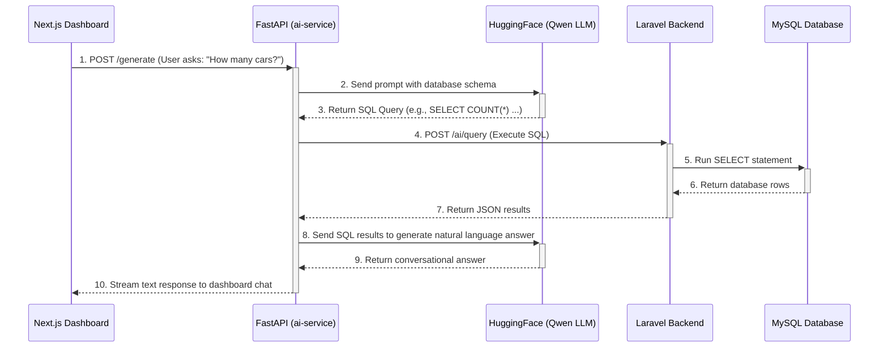
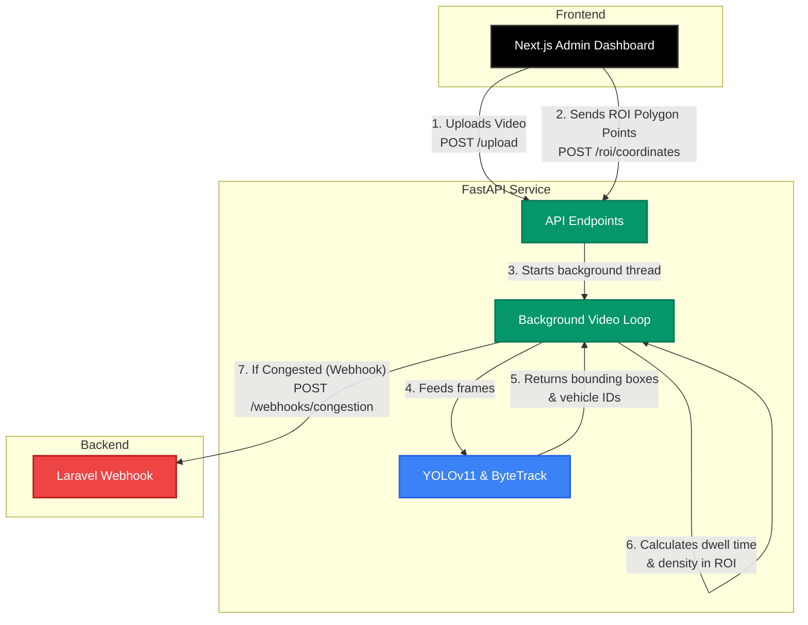

# SmartPark Architecture: The Role of FastAPI

FastAPI acts as the bridge connecting your web applications (Next.js & Laravel) to your Python-based Artificial Intelligence models. Because AI tools like HuggingFace and YOLO run in Python, FastAPI wraps them into standard web servers so your other applications can communicate with them easily.

Here are the diagrams showing exactly how the two FastAPI services fit into your ecosystem:

## 1. AI Text-to-SQL Agent (`ai-service` on port 8001)

This FastAPI service connects your Admin Dashboard chat interface to the HuggingFace LLM and your Laravel database.

 

## 2. Traffic Impact Assessment (`traffic-congestion` on port 8002)

This FastAPI service receives configuration from your frontend, runs computer vision locally on your machine using YOLO, and alerts the backend when congestion occurs.

### Key Takeaways
- **Language Bridge:** Next.js uses TypeScript, Laravel uses PHP, and YOLO/HuggingFace use Python. FastAPI allows them all to talk to each other using HTTP and JSON.
- **Microservices:** By putting the AI in separate FastAPI servers, heavy tasks like video processing don't slow down your Laravel backend or your dashboard UI.
