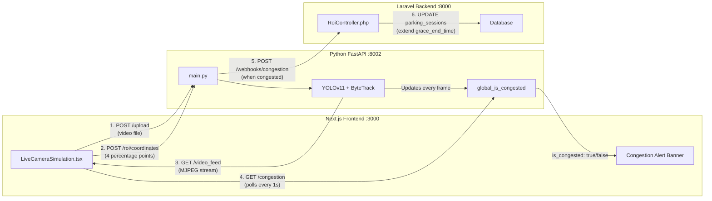
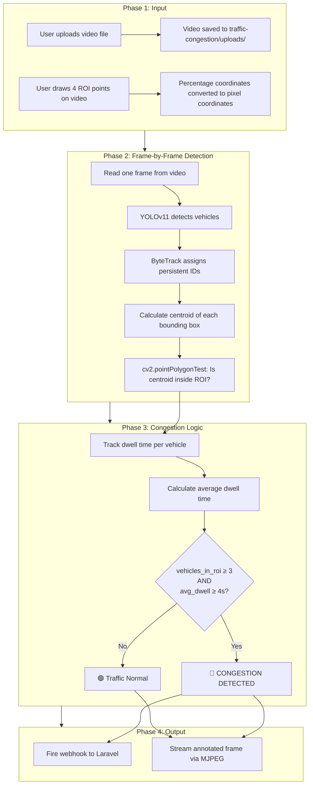
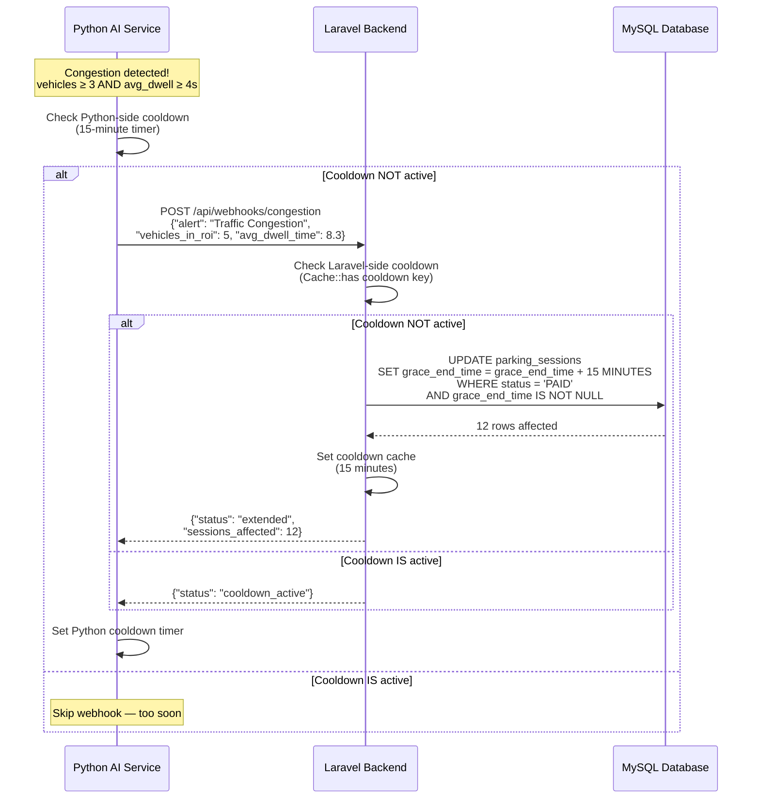

# Traffic Congestion Detection System — Presentation Content

---

## 1. Complete System Architecture

The system consists of **three services** running on separate ports, communicating via REST APIs:



| Service | Technology | Port | Responsibility |
|---|---|---|---|
| **Frontend** | Next.js (React + TypeScript) | 3000 | Upload video, draw ROI, display processed stream, show congestion alerts |
| **Python AI Service** | FastAPI + OpenCV + Ultralytics | 8002 | Run YOLOv11 detection, ByteTrack tracking, calculate congestion, stream processed video |
| **Laravel Backend** | PHP (Laravel + Sanctum) | 8000 | Receive congestion webhooks, extend parking grace periods in MySQL database |

---

## 2. How Traffic Congestion Detection Works

### Step-by-Step Pipeline



---

### 2a. Vehicle Detection — YOLOv11

- **Model**: Custom-trained YOLOv11 (`best.pt`) specifically for detecting cars/vehicles
- **Inference**: Runs on **GPU** (NVIDIA RTX 5050) for real-time performance (~30 FPS)
- **Settings**: Confidence threshold = 0.2, IoU threshold = 0.2
- **Output**: Bounding boxes `(x1, y1, x2, y2)` for each detected vehicle in the frame

### 2b. Persistent Tracking — ByteTrack

- **Purpose**: Ensures the same car keeps the **same ID** across frames
- **How**: ByteTrack compares the position and motion of bounding boxes between consecutive frames. If a box in Frame 2 overlaps closely with a box in Frame 1, it assigns the same ID
- **Stability Filter**: A vehicle must appear for at least **30 consecutive frames** (1 second at 30 FPS) before it is considered "confirmed" — this filters out false detections that flicker in and out
- **Key Parameter**: `persist=True` tells ByteTrack to remember IDs across frames

### 2c. Centroid Calculation

For each detected vehicle, the **centroid** (geometric center) of the bounding box is calculated:

```
centroid_x = (x1 + x2) / 2
centroid_y = (y1 + y2) / 2
```

The centroid is a single point used to determine whether a vehicle is "inside" or "outside" the ROI polygon.

> **Why use the centroid?** A bounding box might partially overlap the ROI boundary. Using a single center point gives a clean yes/no answer: either the car's center is inside, or it is not.

### 2d. Point-in-Polygon Test

OpenCV's `cv2.pointPolygonTest()` checks if the centroid falls inside the 4-point ROI polygon:

| Return Value | Meaning |
|---|---|
| `> 0` | Centroid is **INSIDE** the polygon |
| `= 0` | Centroid is **ON the edge** |
| `< 0` | Centroid is **OUTSIDE** the polygon |

### 2e. Dwell Time Tracking

When a vehicle's centroid **enters** the ROI for the first time, the system records the **frame number** at which it entered.

For every subsequent frame where the vehicle remains inside, the dwell time is calculated as:

```
dwell_time = (current_frame - entry_frame) / video_fps
```

> **Example**: If a car enters at Frame 150 and the current frame is Frame 450, and the video runs at 30 FPS:
> `(450 - 150) / 30 = 10 seconds`

When a vehicle's centroid **leaves** the ROI, it is immediately removed from the tracking dictionary and its timer resets.

### 2f. Congestion Decision

Congestion is flagged **only when BOTH conditions are met simultaneously**:

| Condition | Threshold | Meaning |
|---|---|---|
| **Density** (vehicles currently inside ROI) | ≥ 3 vehicles | Multiple cars are present in the monitored area |
| **Average Dwell Time** | ≥ 4 seconds | Cars are not just passing through — they are stopped/slow |

```python
is_congested = (
    vehicles_in_roi >= 3
    and avg_dwell_time >= 4
)
```

If only one condition is met (e.g., 5 cars but they're all moving fast), congestion is **NOT** triggered.

---

## 3. Grace Period Extension Flow

When congestion is detected, the system automatically extends the grace period for all paid parking sessions, giving drivers more time to exit before penalties apply.



### Double Cooldown Safety Net

The system has **two independent 15-minute cooldowns** to prevent spamming:

| Layer | Mechanism | Purpose |
|---|---|---|
| **Python (FastAPI)** | `last_congestion_webhook_time` — checks `time.time()` against a 900-second (15 min) cooldown | Prevents the Python loop from firing the webhook more than once every 15 minutes |
| **Laravel (PHP)** | `Cache::put('congestion_grace_cooldown', true, 15 min)` — server-side cache key | Safety net — even if Python fires twice, Laravel rejects the duplicate |

### What gets extended?

- **Target**: All parking sessions with `status = PAID` and a non-null `grace_end_time`
- **Extension**: `grace_end_time` is pushed forward by **15 minutes**
- **SQL**: `DATE_ADD(grace_end_time, INTERVAL 15 MINUTE)`

### How does the frontend congestion alert get updated?

The frontend polls `GET /congestion` **every 1 second**. This endpoint returns a simple boolean (`is_congested: true` or `false`) which Python updates on every single frame. Based on this value, the frontend dynamically switches between:
- 🔴 **Red Alert** — "Traffic Congestion Alert! Vehicle dwelling in the ROI for too long."
- 🟢 **Green Alert** — "Traffic Normal. No congestion detected in ROI."

This polling is **completely independent** from the webhook/grace extension. The alert banner is purely a display feature for the dashboard operator — it does not trigger any database changes.

### Can the grace period extend more than once?

**Yes**, but only once every 15 minutes, and it is triggered by a **fresh real-time check**, not a queued or stored request.

Here is exactly how it works:

1. At **minute 0**: The Python loop detects congestion on the current frame. It checks its cooldown timer → cooldown is not active → it fires the webhook to Laravel → Laravel extends grace periods by 15 minutes → both Python and Laravel start their 15-minute cooldown timers.
2. At **minute 1 to 14**: The Python loop continues detecting congestion on every frame, but each time it checks its cooldown timer → cooldown IS still active → it skips the webhook. No extension happens.
3. At **minute 15**: The Python cooldown timer expires. On the very next frame where congestion is still detected, it checks the cooldown again → cooldown is no longer active → it fires a **brand new** webhook to Laravel based on the **current live congestion status**. Laravel extends again.
4. If congestion has **stopped** by minute 15 (e.g., the cars have cleared), the cooldown expires silently. No webhook is fired because `is_congested` is now `false`.

> **Key Point**: The system does NOT queue or remember old congestion events. Every extension is triggered by actively checking "Is there congestion happening RIGHT NOW?" at the exact moment the cooldown expires.

---

## 4. Video Streaming to Frontend (MJPEG)

After the Python backend processes each frame (draws bounding boxes, ROI polygon, dwell timers, HUD), the annotated frame is:

1. Stored in a shared memory variable (`latest_frame`)
2. Encoded as JPEG by the `/video_feed` endpoint
3. Streamed to the frontend as a continuous MJPEG (Motion JPEG) stream
4. Displayed in the browser using a simple `` tag

The browser natively supports MJPEG streams — no WebSocket or WebRTC is required.

### Frontend Display States

| State | What is shown |
|---|---|
| **No video uploaded** | Upload placeholder icon |
| **Video uploaded, drawing ROI** | Raw video + SVG overlay with crosshair cursor for clicking 4 points |
| **ROI saved, processing started** | MJPEG stream from Python showing the fully annotated video with bounding boxes, dwell timers, and congestion status |

---

## 5. Key Technical Decisions

| Decision | Why |
|---|---|
| **Frame-based dwell time** instead of `time.time()` | Ensures dwell time is accurate to the video timeline, regardless of CPU/GPU processing speed |
| **Percentage-based ROI coordinates** | ROI scales correctly across different screen sizes and video resolutions |
| **MJPEG streaming** instead of `cv2.imshow()` | Allows the processed video to be viewed directly in the browser without needing physical access to the Python server |
| **GPU inference (RTX 5050)** | Processes frames at ~30 FPS, keeping up with real-time video and ensuring accurate tracking |
| **Double cooldown on webhook** | Prevents accidental spam of grace period extensions from both the Python and Laravel sides |
